# Product Requirements Document (PRD)
## Sistem Informasi Manajemen Rumah Sakit (SIMRS) Modular Desktop

**Versi Dokumen:** 1.0  
**Tanggal:** 13 Agustus 2026  
**Status:** Draft Baseline untuk Pengembangan Production  
**Platform Utama:** Desktop  
**Bahasa/Framework Utama:** Lazarus / Free Pascal  
**Database:** PostgreSQL  
**Layanan Cetak:** Spring Boot + JasperReports  
**Arsitektur Produk:** Modular Monolith Desktop dengan Domain-Based Module  
**Target Implementasi:** Rumah Sakit di Indonesia  

---

# 1. Ringkasan Eksekutif

Sistem Informasi Manajemen Rumah Sakit (SIMRS) Modular Desktop adalah aplikasi terintegrasi untuk mendukung proses pelayanan klinis, administratif, farmasi, persediaan, billing, kasir, dan akuntansi rumah sakit dalam satu aplikasi utama berbasis desktop.

Aplikasi utama dikembangkan menggunakan Lazarus dan berfungsi sebagai **SIMRS Main Application / Application Shell**. Seluruh fungsi bisnis SIMRS disusun dalam modul-modul terpisah tetapi tetap dijalankan dalam satu aplikasi yang konsisten bagi pengguna. PostgreSQL digunakan sebagai basis data transaksi utama.

Spring Boot dan JasperReports **hanya digunakan sebagai centralized print/report service**. Komponen tersebut tidak menangani business logic, transaksi pelayanan, pengurangan stok, billing, maupun posting akuntansi.

Desain produk menggunakan prinsip bahwa satu transaksi pelayanan harus dapat ditelusuri secara end-to-end sejak pasien melakukan pendaftaran sampai pelayanan selesai, termasuk keterkaitan dengan resep, pengeluaran obat, pergerakan persediaan, billing, pembayaran, serta jurnal akuntansi.

Alur utama produk adalah:

```text
PENDAFTARAN
    ↓
ANTREAN
    ↓
KEPERAWATAN
    ↓
DOKTER
    ↓
RESEP / TINDAKAN / PENUNJANG
    ↓
FARMASI
    ↓
INVENTORY
    ↓
BILLING
    ↓
KASIR / PIUTANG PENJAMIN
    ↓
ACCOUNTING
```

---

# 2. Latar Belakang

Operasional rumah sakit melibatkan banyak unit pelayanan dengan proses yang saling bergantung. Pendaftaran pasien menghasilkan kunjungan yang kemudian diteruskan ke antrean pelayanan. Data pemeriksaan keperawatan menjadi bagian dari rekam medis yang digunakan dokter. Dokter dapat menghasilkan diagnosis, tindakan, resep, maupun permintaan pemeriksaan penunjang.

Resep dokter akan diproses oleh farmasi dan berdampak pada persediaan obat serta billing pasien. Pelayanan medis dan farmasi menghasilkan komponen tagihan yang selanjutnya diproses melalui billing dan kasir atau dicatat sebagai piutang kepada penjamin. Seluruh transaksi keuangan tersebut harus dapat diteruskan secara konsisten ke modul akuntansi.

Tanpa desain terintegrasi, risiko yang sering muncul adalah:

- data pasien ganda;
- antrean pelayanan tidak sinkron;
- catatan keperawatan dan dokter terpisah;
- resep tidak terhubung dengan stok;
- stok berkurang sebelum obat benar-benar diserahkan;
- nilai billing berbeda dengan transaksi pelayanan;
- pembayaran tidak terhubung dengan piutang;
- jurnal akuntansi harus diinput ulang;
- nilai persediaan tidak sesuai dengan ledger;
- histori perubahan data sulit diaudit;
- cetakan dokumen tidak memiliki kontrol versi.

PRD ini menjadi acuan pengembangan agar SIMRS memiliki arsitektur dan proses bisnis yang konsisten untuk penggunaan production.

---

# 3. Tujuan Produk

SIMRS dikembangkan untuk:

1. membangun satu aplikasi rumah sakit yang modular, terintegrasi, dan mudah dikembangkan;
2. menyediakan alur pelayanan pasien end-to-end;
3. membangun rekam medis elektronik yang terintegrasi dengan episode pelayanan;
4. menyediakan antrean pelayanan lintas unit;
5. mengintegrasikan pelayanan dokter dengan farmasi dan inventory;
6. memastikan setiap transaksi pelayanan menghasilkan billing yang dapat ditelusuri;
7. mengintegrasikan pembayaran dan piutang dengan akuntansi;
8. membangun inventory berbasis batch, tanggal kedaluwarsa, dan stock ledger;
9. menyediakan audit trail atas transaksi penting;
10. menyediakan centralized printing melalui Spring Boot dan JasperReports;
11. menyiapkan struktur data yang mudah dipetakan ke integrasi BPJS dan SATUSEHAT;
12. memungkinkan penambahan modul tanpa harus mendesain ulang aplikasi utama.

---

# 4. Sasaran Produk

## 4.1 Sasaran Operasional

Sistem harus memungkinkan seluruh unit yang terlibat dalam pelayanan pasien mengakses data yang sama sesuai kewenangannya.

## 4.2 Sasaran Klinis

Sistem harus menyediakan informasi klinis pasien yang terstruktur, berkesinambungan, dapat ditelusuri, dan memiliki histori perubahan.

## 4.3 Sasaran Keuangan

Seluruh transaksi pelayanan yang memiliki konsekuensi finansial harus dapat menghasilkan charge, invoice, pembayaran/piutang, dan accounting event secara konsisten.

## 4.4 Sasaran Inventory

Setiap pergerakan persediaan harus mempunyai sumber transaksi, lokasi, batch, kuantitas, nilai, waktu, serta pengguna yang melakukan transaksi.

## 4.5 Sasaran Manajemen

Data operasional harus dapat digunakan untuk laporan pelayanan, antrean, farmasi, inventory, billing, keuangan, dan indikator manajemen.

---

# 5. Prinsip Desain Produk

## 5.1 Satu Aplikasi Utama

Pengguna menjalankan satu aplikasi utama SIMRS.

```text
SIMRS.EXE
   │
   ├── Authentication
   ├── Dashboard
   ├── Module Manager
   ├── RBAC
   ├── Notification
   ├── Common UI
   └── Application Modules
```

## 5.2 Modular Business Domain

Setiap domain memiliki modul sendiri.

```text
modules/
├── core/
├── master/
├── patient/
├── registration/
├── queue/
├── nursing/
├── physician/
├── pharmacy/
├── inventory/
├── billing/
├── cashier/
├── accounting/
├── medical_record/
├── reporting/
├── audit/
└── integration/
```

## 5.3 UI Tidak Menjadi Tempat Business Logic

Form Lazarus bertanggung jawab terhadap presentasi dan interaksi pengguna.

Business rule ditempatkan pada service/domain layer.

Contoh:

```text
TFormPrescription
        │
        ▼
PrescriptionService
        │
        ▼
PrescriptionRepository
        │
        ▼
PostgreSQL
```

Pola berikut harus dihindari:

```text
Form
 ↓
SQL langsung untuk seluruh proses bisnis
 ↓
Update banyak tabel tanpa service/domain rule
```

## 5.4 Database sebagai Transactional Source of Truth

PostgreSQL menjadi sumber data transaksi utama.

## 5.5 Traceability

Setiap transaksi harus dapat dilacak ke transaksi sumbernya.

## 5.6 Auditability

Transaksi penting harus mempunyai informasi:

- siapa;
- melakukan apa;
- kapan;
- workstation;
- nilai sebelum perubahan;
- nilai sesudah perubahan;
- alasan perubahan jika diperlukan.

## 5.7 Reversal Instead of Destructive Delete

Transaksi yang sudah finalized tidak boleh dihapus secara fisik.

Koreksi dilakukan melalui:

- cancel;
- void;
- reversal;
- adjustment;
- amendment.

---

# 6. Arsitektur Teknologi

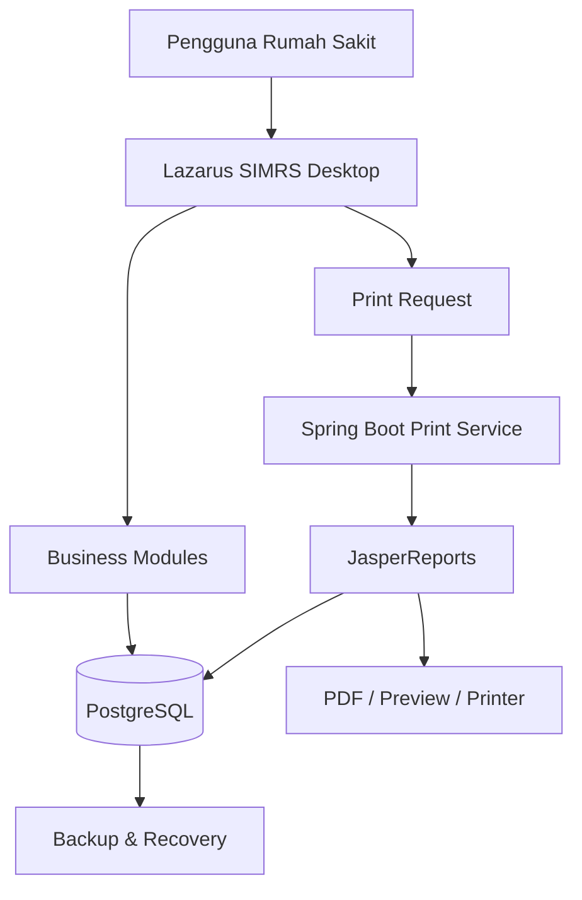

## 6.1 Lazarus

Digunakan untuk:

- desktop UI;
- autentikasi;
- RBAC;
- master data;
- pelayanan klinis;
- farmasi;
- inventory;
- billing;
- kasir;
- accounting;
- dashboard operasional;
- konfigurasi aplikasi.

## 6.2 PostgreSQL

Digunakan untuk:

- master data;
- transaksi;
- rekam medis;
- antrean;
- inventory;
- billing;
- pembayaran;
- jurnal;
- audit;
- konfigurasi;
- integrasi staging/outbox.

## 6.3 Spring Boot + JasperReports

Hanya digunakan sebagai **service pencetakan**.

Tidak digunakan untuk:

- menghitung tarif;
- membuat billing;
- mengurangi stok;
- membuat resep;
- posting jurnal;
- menjalankan antrean;
- memproses pelayanan klinis.

Flow:

```text
Lazarus
   ↓
Request Cetak
   ↓
Spring Boot
   ↓
JasperReports
   ↓
Query Data
   ↓
PDF / Preview / Printer
```

---

# 7. Baseline Regulasi dan Interoperabilitas

Pengembangan harus memperhatikan ketentuan yang berlaku pada saat implementasi, antara lain:

1. Peraturan Menteri Kesehatan Nomor 24 Tahun 2022 tentang Rekam Medis;
2. Peraturan Menteri Kesehatan Nomor 6 Tahun 2026 tentang Rumah Sakit;
3. ketentuan perlindungan data dan keamanan informasi yang berlaku;
4. ketentuan Jaminan Kesehatan Nasional yang relevan;
5. standar interoperabilitas SATUSEHAT;
6. standar terminologi klinis yang diwajibkan pada proses integrasi.

Struktur internal SIMRS tidak harus sama dengan struktur FHIR. Sistem perlu memiliki mapping layer agar data internal dapat ditransformasikan ke format interoperabilitas eksternal.

Referensi resmi:

- JDIH Kementerian Kesehatan — Permenkes 24 Tahun 2022  
  https://jdih.kemkes.go.id/documents/peraturan-menteri-kesehatan-nomor-24-tahun-2022
- JDIH Kementerian Kesehatan — Permenkes 6 Tahun 2026  
  https://jdih.kemkes.go.id/documents/peraturan-menteri-kesehatan-nomor-6-tahun-2026
- SATUSEHAT Platform — FHIR  
  https://satusehat.kemkes.go.id/platform/docs/id/fhir/
- SATUSEHAT Platform — Panduan Interoperabilitas  
  https://satusehat.kemkes.go.id/platform/docs/id/interoperability/

> Ketentuan regulasi dan spesifikasi integrasi harus diverifikasi kembali pada setiap release production karena dapat berubah.

---

# 8. Ruang Lingkup

## 8.1 Core Platform

- login;
- user;
- role;
- permission;
- pegawai;
- dokter;
- perawat;
- apoteker;
- unit;
- ruangan;
- workstation;
- parameter;
- konfigurasi;
- audit log;
- application module registry.

## 8.2 Master Data

- pasien;
- penjamin;
- dokter;
- unit pelayanan;
- poli;
- ruang;
- kamar;
- bed;
- tindakan;
- tarif;
- obat;
- barang;
- supplier;
- gudang;
- satuan;
- chart of accounts;
- cost center;
- revenue center.

## 8.3 Front Office

- registrasi pasien;
- appointment;
- kunjungan;
- encounter;
- antrean.

## 8.4 Clinical

- keperawatan;
- dokter;
- diagnosis;
- procedure/tindakan;
- resep;
- rekam medis;
- riwayat pelayanan.

## 8.5 Pharmacy

- resep elektronik;
- verifikasi resep;
- dispensing;
- etiket;
- retur obat.

## 8.6 Inventory

- receiving;
- batch;
- expiry;
- transfer;
- stock movement;
- stock balance;
- stock opname;
- adjustment;
- minimum stock;
- reorder point.

## 8.7 Revenue Cycle

- charge item;
- billing;
- invoice;
- discount authorization;
- kasir;
- payment;
- refund;
- account receivable.

## 8.8 Accounting

- chart of accounts;
- accounting mapping;
- accounting event;
- jurnal;
- general ledger;
- neraca saldo;
- laba rugi;
- neraca;
- arus kas;
- rekonsiliasi.

## 8.9 Reporting

- preview;
- PDF;
- print;
- reprint;
- report audit.

---

# 9. Ruang Lingkup Pengembangan Bertahap

## 9.1 Phase 1 — Core Rawat Jalan

Target utama:

- master data;
- patient registry;
- pendaftaran;
- queue engine;
- keperawatan;
- dokter;
- resep;
- farmasi;
- inventory;
- billing;
- kasir;
- accounting;
- Jasper print service;
- audit.

## 9.2 Phase 2 — Pelayanan Lanjutan

- IGD;
- rawat inap;
- bed management;
- operasi;
- laboratorium;
- radiologi;
- rehabilitasi;
- gizi;
- bank darah;
- CSSD.

## 9.3 Phase 3 — Ekosistem dan Integrasi

- BPJS;
- antrean Mobile JKN;
- SATUSEHAT;
- PACS;
- LIS;
- perangkat medis;
- kiosk;
- mobile doctor;
- portal pasien;
- executive dashboard.

---

# 10. Aktor Sistem

| Aktor | Tanggung Jawab Utama |
|---|---|
| Administrator | konfigurasi, pengguna, role, module |
| Petugas Pendaftaran | registrasi dan kunjungan |
| Petugas Antrean | pengelolaan antrean |
| Perawat | asesmen dan vital sign |
| Dokter | pemeriksaan, diagnosis, tindakan, resep |
| Apoteker | verifikasi resep dan dispensing |
| Asisten Farmasi | penyiapan obat |
| Petugas Gudang | receiving dan inventory |
| Billing Officer | verifikasi billing |
| Kasir | pembayaran dan refund |
| Accounting | jurnal, GL, rekonsiliasi |
| Manajemen | dashboard dan laporan |
| Auditor | audit trail dan pemeriksaan transaksi |

---

# 11. Role-Based Access Control

Permission tidak hanya berbasis menu tetapi berbasis aksi.

Contoh:

```text
PHARMACY.PRESCRIPTION.VIEW
PHARMACY.PRESCRIPTION.VERIFY
PHARMACY.DISPENSE
PHARMACY.RETURN

INVENTORY.STOCK.VIEW
INVENTORY.RECEIVE
INVENTORY.TRANSFER
INVENTORY.ADJUST

BILLING.VIEW
BILLING.FINALIZE
BILLING.DISCOUNT

ACCOUNTING.JOURNAL.POST
ACCOUNTING.JOURNAL.REVERSE
```

Satu pengguna dapat memiliki lebih dari satu role.

Role dapat dibatasi berdasarkan:

- rumah sakit;
- unit;
- lokasi;
- gudang;
- poli;
- cost center.

---

# 12. Konsep Pasien, Visit, dan Encounter

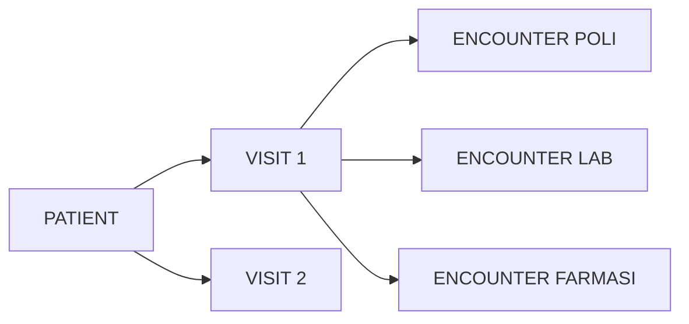

## 12.1 Patient

Representasi identitas pasien.

## 12.2 Visit

Episode kedatangan pasien ke rumah sakit.

## 12.3 Encounter

Interaksi pelayanan tertentu selama visit.

Contoh:

```text
Patient
   ↓
Visit
   ├── Encounter Keperawatan
   ├── Encounter Dokter
   ├── Encounter Laboratorium
   └── Encounter Farmasi
```

---

# 13. Master Patient Index

Sistem harus meminimalkan pasien ganda.

Identifier dapat mencakup:

- nomor rekam medis;
- NIK;
- nomor paspor;
- nomor identitas lain;
- nomor peserta penjamin.

Sebelum membuat pasien baru, sistem melakukan pencarian berdasarkan kombinasi:

- NIK;
- nama;
- tanggal lahir;
- jenis kelamin;
- nomor telepon;
- nomor rekam medis.

Merge pasien hanya dapat dilakukan oleh role yang berwenang dan wajib memiliki audit trail.

---

# 14. End-to-End Patient Journey

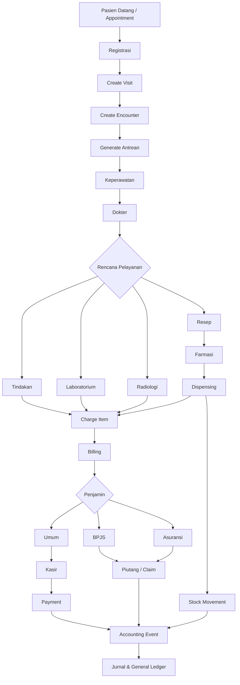

---

# 15. Modul Pendaftaran

## 15.1 Fitur

- pencarian pasien;
- registrasi pasien baru;
- verifikasi identitas;
- pemilihan penjamin;
- appointment;
- pemilihan poli;
- pemilihan dokter;
- jadwal dokter;
- pembuatan visit;
- pembuatan encounter;
- nomor antrean;
- cetak label/kartu jika diperlukan.

## 15.2 Requirement

### REG-001

Sistem harus mencari pasien sebelum mengizinkan pembuatan pasien baru.

### REG-002

Sistem harus membuat nomor rekam medis unik.

### REG-003

Sistem harus mencatat penjamin pada visit.

### REG-004

Sistem harus dapat menentukan poli dan dokter tujuan.

### REG-005

Setelah registrasi berhasil, sistem harus membuat antrean pelayanan.

### REG-006

Registrasi yang dibatalkan harus menghasilkan status CANCELLED, bukan penghapusan data.

---

# 16. Queue Engine

Antrean harus menjadi engine tersendiri.

## 16.1 Queue Type

Contoh:

```text
REGISTRATION
NURSING
DOCTOR
LAB
RADIOLOGY
PHARMACY
BILLING
CASHIER
```

## 16.2 Status

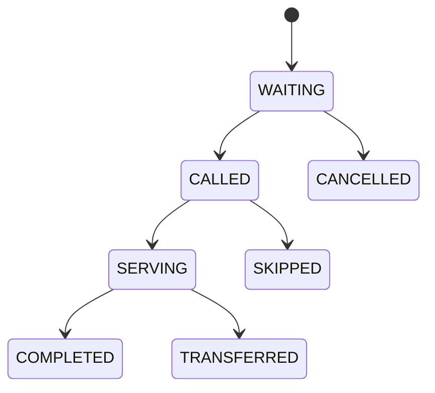

## 16.3 Data Minimum

```text
queue_id
visit_id
encounter_id
patient_id
queue_type
service_unit_id
doctor_id
queue_number
priority
status
created_at
called_at
service_started_at
completed_at
workstation_id
```

## 16.4 Requirement

### QUE-001

Nomor antrean harus unik per konfigurasi layanan dan tanggal.

### QUE-002

Sistem harus mendukung prioritas pasien.

### QUE-003

Sistem harus menyimpan seluruh timestamp untuk pengukuran waiting time.

### QUE-004

Pemanggilan pasien harus tercatat.

### QUE-005

Sistem harus dapat menampilkan antrean berdasarkan unit, dokter, dan status.

### QUE-006

Sistem harus dapat menghitung:

- waktu tunggu;
- service time;
- total antrean;
- pasien selesai;
- pasien belum dilayani.

---

# 17. Flow Keperawatan

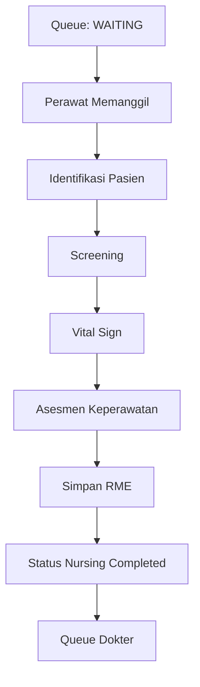

## 17.1 Data Keperawatan

Minimal:

- keluhan utama;
- tekanan darah;
- nadi;
- respirasi;
- suhu;
- SpO2;
- berat badan;
- tinggi badan;
- tingkat nyeri;
- screening risiko;
- alergi yang diketahui;
- catatan keperawatan.

## 17.2 Requirement

### NUR-001

Perawat hanya dapat mencatat asesmen pada encounter yang aktif.

### NUR-002

Vital sign harus memiliki waktu pemeriksaan dan petugas.

### NUR-003

Data klinis yang telah ditandatangani tidak boleh dihapus.

### NUR-004

Perubahan setelah finalisasi harus disimpan sebagai amendment/version.

### NUR-005

Dokter harus dapat melihat hasil asesmen keperawatan sebelum melakukan pemeriksaan.

---

# 18. Flow Dokter

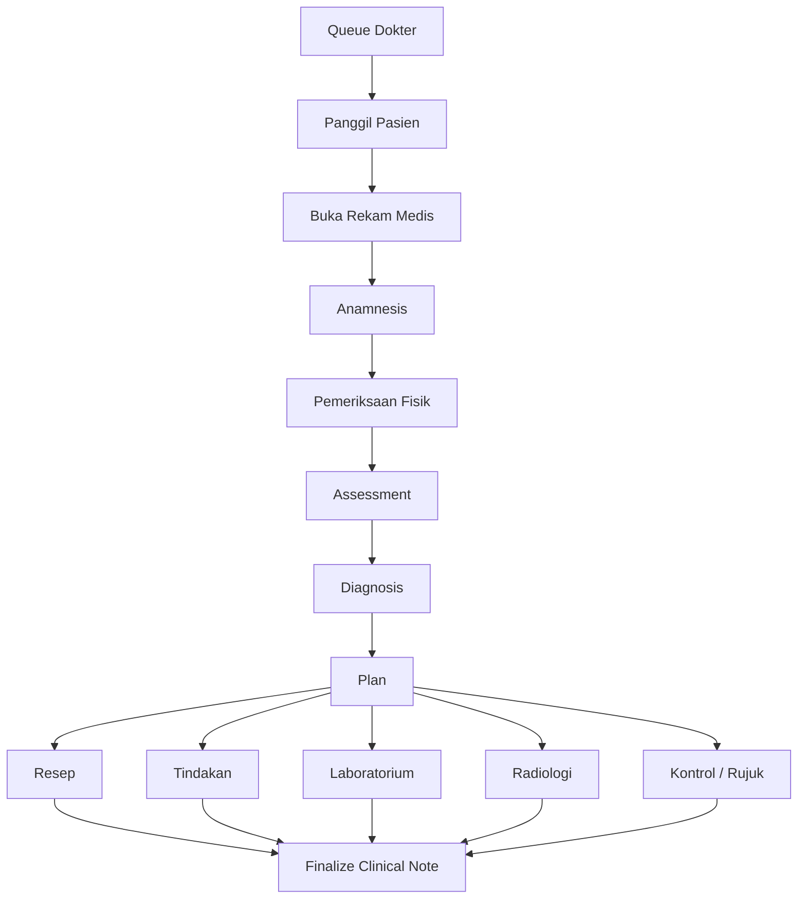

## 18.1 Requirement

### DOC-001

Dokter harus dapat melihat riwayat encounter pasien sesuai kewenangannya.

### DOC-002

Dokter harus dapat mencatat:

- subjective;
- objective;
- assessment;
- plan.

### DOC-003

Diagnosis harus mendukung diagnosis utama dan sekunder.

### DOC-004

Dokter harus dapat membuat resep elektronik.

### DOC-005

Dokter harus dapat membuat order pemeriksaan penunjang.

### DOC-006

Dokter harus dapat mencatat tindakan.

### DOC-007

Clinical note yang telah finalized tidak dapat dihapus.

---

# 19. Modul Resep Elektronik

## 19.1 Prinsip

Prescription tidak sama dengan stock issue.

```text
PRESCRIPTION
     ↓
VERIFICATION
     ↓
RESERVATION
     ↓
DISPENSING
     ↓
STOCK ISSUE
```

## 19.2 Status Resep

```text
DRAFT
SUBMITTED
VERIFIED
PREPARING
READY
DISPENSED
PARTIAL
CANCELLED
RETURNED
```

## 19.3 Data Resep

- prescription_id;
- encounter_id;
- doctor_id;
- medication_id;
- dosage;
- frequency;
- route;
- duration;
- quantity;
- instruction;
- racikan/non-racikan;
- status.

---

# 20. Flow Farmasi

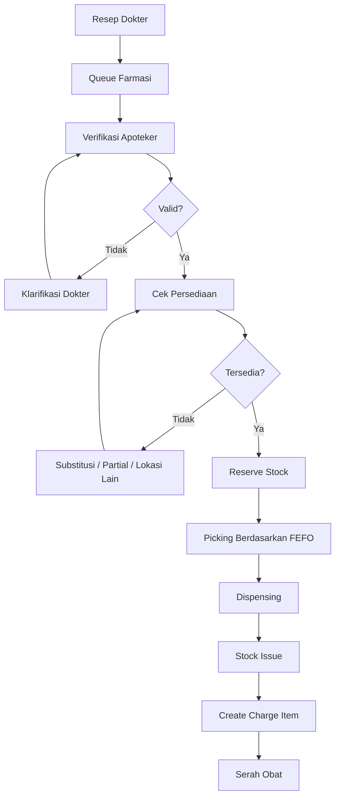

## 20.1 Validasi Farmasi

Sistem harus memungkinkan pemeriksaan:

- alergi;
- duplikasi obat;
- dosis;
- jumlah;
- rute;
- ketersediaan;
- formularium;
- catatan apoteker.

## 20.2 Requirement

### PHA-001

Resep harus berasal dari encounter.

### PHA-002

Farmasi tidak boleh mengubah prescription asli tanpa mekanisme yang dapat diaudit.

### PHA-003

Verifikasi resep harus mencatat petugas dan waktu.

### PHA-004

Stock tidak boleh berkurang saat resep baru dibuat.

### PHA-005

Stock issue hanya terjadi saat dispensing dikonfirmasi.

### PHA-006

Sistem harus mendukung partial dispensing.

### PHA-007

Sistem harus mendukung retur obat dengan referensi transaksi dispensing.

---

# 21. Inventory Management

Inventory menggunakan **perpetual stock ledger**.

## 21.1 Struktur

```text
ITEM
  │
  ├── WAREHOUSE
  │      │
  │      └── LOCATION
  │
  └── BATCH
         ├── batch_no
         ├── expiry_date
         ├── acquisition_cost
         └── quantity
```

## 21.2 Stock Movement Type

```text
OPENING
PURCHASE_RECEIPT
TRANSFER_IN
TRANSFER_OUT
DISPENSING
PATIENT_RETURN
SUPPLIER_RETURN
ADJUSTMENT_PLUS
ADJUSTMENT_MINUS
STOCK_OPNAME
EXPIRED
DAMAGED
```

## 21.3 Formula

```text
ENDING STOCK
=
OPENING STOCK
+ RECEIPT
+ TRANSFER IN
+ RETURN IN
- DISPENSING
- TRANSFER OUT
- RETURN OUT
± ADJUSTMENT
```

## 21.4 Batch dan Expiry

Sistem wajib mendukung:

- batch number;
- expiry date;
- tanggal penerimaan;
- supplier;
- harga perolehan;
- lokasi penyimpanan.

## 21.5 FEFO

Pengeluaran obat secara default menggunakan:

**First Expired First Out (FEFO).**

Override batch harus memerlukan permission dan alasan.

## 21.6 Alert

- expired;
- mendekati expired;
- minimum stock;
- reorder point;
- stock out;
- overstock;
- slow moving;
- dead stock.

---

# 22. Stock Reservation

Untuk mencegah overselling:

```text
On Hand Stock
-
Reserved Stock
=
Available Stock
```

Contoh:

```text
On Hand      = 100
Reserved     = 20
Available    = 80
```

Reservation dapat digunakan ketika resep telah diverifikasi dan sedang dipersiapkan.

Reservation harus dilepas jika:

- resep dibatalkan;
- dispensing dibatalkan;
- batas waktu reservation telah terlewati;
- item diganti.

---

# 23. Inventory Ledger Requirement

### INV-001

Setiap stock movement harus mempunyai transaction source.

### INV-002

Stock movement tidak dapat dihapus setelah posted.

### INV-003

Correction dilakukan melalui reversal/adjustment.

### INV-004

Setiap movement harus menyimpan:

```text
movement_id
item_id
batch_id
warehouse_id
location_id
movement_type
reference_type
reference_id
qty_in
qty_out
unit_cost
movement_at
created_by
```

### INV-005

Sistem harus dapat menelusuri:

```text
Stock Movement
      ↓
Dispensing
      ↓
Prescription
      ↓
Encounter
      ↓
Patient
```

---

# 24. Billing Architecture

Setiap unit pelayanan membuat **Charge Item**, bukan langsung mengubah total invoice.

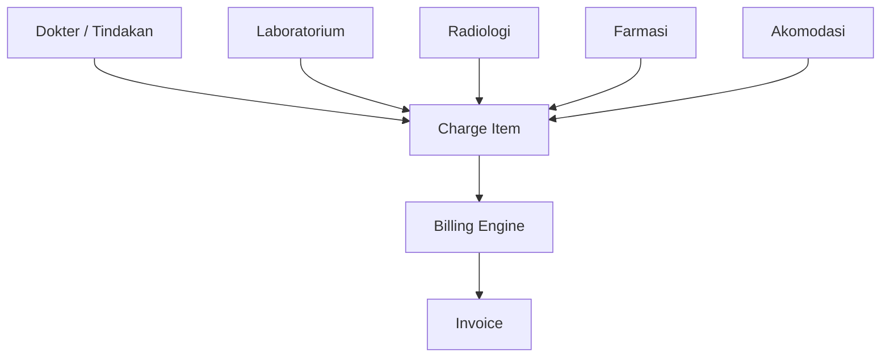

## 24.1 Charge Item

Contoh data:

```text
charge_id
visit_id
encounter_id
patient_id
service_unit_id
source_type
source_id
item_type
item_id
qty
unit_price
gross_amount
discount
net_amount
status
```

## 24.2 Status Charge

```text
DRAFT
POSTED
VOID
BILLED
```

---

# 25. Billing Engine

Billing Engine bertanggung jawab untuk:

- mengumpulkan charge;
- menghitung tarif;
- menentukan komponen;
- menerapkan kebijakan penjamin;
- discount yang diotorisasi;
- membentuk invoice;
- finalisasi billing.

Billing Engine tidak menangani penerimaan uang.

---

# 26. Billing dan Kasir Harus Dipisahkan

```text
BILLING
=
menentukan kewajiban/tagihan

CASHIER
=
menerima atau mengembalikan pembayaran
```

Flow:

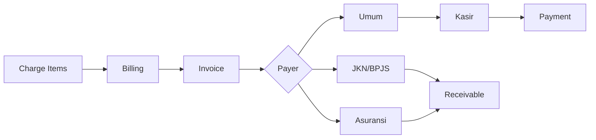

---

# 27. Modul Kasir

## 27.1 Fitur

- pembayaran tunai;
- kartu;
- transfer;
- metode pembayaran lainnya;
- multi-payment;
- deposit;
- refund;
- void dengan authorization;
- shift kasir;
- closing kasir;
- rekonsiliasi.

## 27.2 Requirement

### CASH-001

Payment harus memiliki referensi invoice.

### CASH-002

Nomor pembayaran harus unik.

### CASH-003

Void/refund membutuhkan alasan.

### CASH-004

Kasir tidak boleh mengubah invoice klinis.

### CASH-005

Closing shift harus menghasilkan saldo expected vs actual.

---

# 28. Accounting Architecture

Accounting tidak melakukan input ulang seluruh transaksi operasional.

Transaksi SIMRS menghasilkan **Accounting Event**.

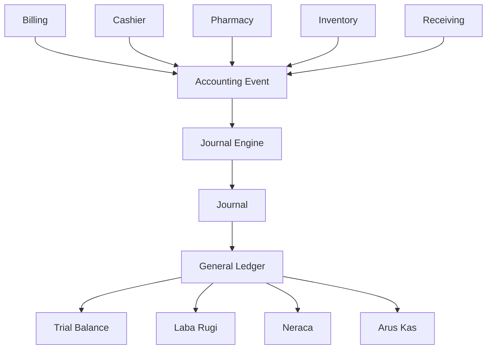

---

# 29. Chart of Accounts

COA harus mendukung hierarchy.

Contoh:

```text
1 ASET
  1.1 Aset Lancar
      1.1.01 Kas
      1.1.02 Bank
      1.1.03 Piutang Pasien
      1.1.04 Piutang BPJS
      1.1.05 Persediaan Obat

2 KEWAJIBAN

3 EKUITAS

4 PENDAPATAN
  4.1 Pendapatan Pelayanan
  4.2 Pendapatan Farmasi

5 BEBAN
  5.1 HPP Obat
  5.2 Beban Operasional
```

COA harus configurable dan tidak hard-coded pada source code.

---

# 30. Accounting Mapping

Mapping transaksi ke COA harus configurable.

Contoh:

| Event | Debit | Kredit |
|---|---|---|
| Billing Pelayanan Umum | Piutang Pasien | Pendapatan Pelayanan |
| Pembayaran Pasien | Kas/Bank | Piutang Pasien |
| Billing BPJS | Piutang BPJS | Pendapatan Pelayanan |
| Dispensing/HPP | HPP Obat | Persediaan Obat |
| Pembelian Persediaan Kredit | Persediaan | Hutang Supplier |

---

# 31. Contoh Jurnal Otomatis

## 31.1 Pelayanan Pasien Umum

Tagihan Rp500.000:

```text
Dr Piutang Pasien               500.000
   Cr Pendapatan Pelayanan      500.000
```

Pembayaran:

```text
Dr Kas/Bank                     500.000
   Cr Piutang Pasien            500.000
```

## 31.2 Penjualan Obat

Harga jual: Rp100.000  
HPP: Rp70.000

Pendapatan:

```text
Dr Piutang Pasien               100.000
   Cr Pendapatan Farmasi        100.000
```

Persediaan:

```text
Dr HPP Obat                      70.000
   Cr Persediaan Obat            70.000
```

---

# 32. Accounting Event

Contoh event:

```text
BILLING_POSTED
PAYMENT_RECEIVED
PAYMENT_REFUNDED
MEDICATION_DISPENSED
PATIENT_RETURN_RECEIVED
INVENTORY_RECEIVED
INVENTORY_ADJUSTED
SUPPLIER_RETURNED
```

Setiap event:

```text
event_id
event_type
source_type
source_id
business_date
amount
status
created_at
processed_at
```

---

# 33. Transaction Outbox

Untuk transaksi yang menghasilkan proses lanjutan, dapat digunakan pola Transactional Outbox.

Contoh:

```text
BEGIN DATABASE TRANSACTION

1. Save Dispensing
2. Create Stock Movement
3. Create Charge
4. Create Accounting Event
5. Create Outbox Event

COMMIT
```

Worker kemudian dapat menangani proses asinkron seperti:

- integrasi eksternal;
- notifikasi;
- sinkronisasi;
- retry;
- proses background.

Tujuannya mencegah kondisi transaksi utama berhasil tetapi proses lanjutan hilang.

---

# 34. Correlation dan Traceability

Setiap transaksi harus membawa identifier referensi.

Contoh:

```text
Patient
P000001
   ↓
Visit
V202608130001
   ↓
Encounter
E202608130001
   ↓
Prescription
RX202608130012
   ↓
Dispensing
DSP202608130008
   ↓
Stock Movement
SM202608130045
   ↓
Charge
CH202608130078
   ↓
Invoice
INV202608130032
   ↓
Payment
PAY202608130018
   ↓
Journal
JV202608130061
```

Sistem harus dapat melakukan drill-down dua arah.

Dari journal:

```text
Journal
→ Payment
→ Invoice
→ Charge
→ Dispensing/Tindakan
→ Encounter
→ Patient
```

Dari pasien:

```text
Patient
→ Encounter
→ Pelayanan
→ Billing
→ Payment
→ Accounting
```

---

# 35. Data Model Konseptual

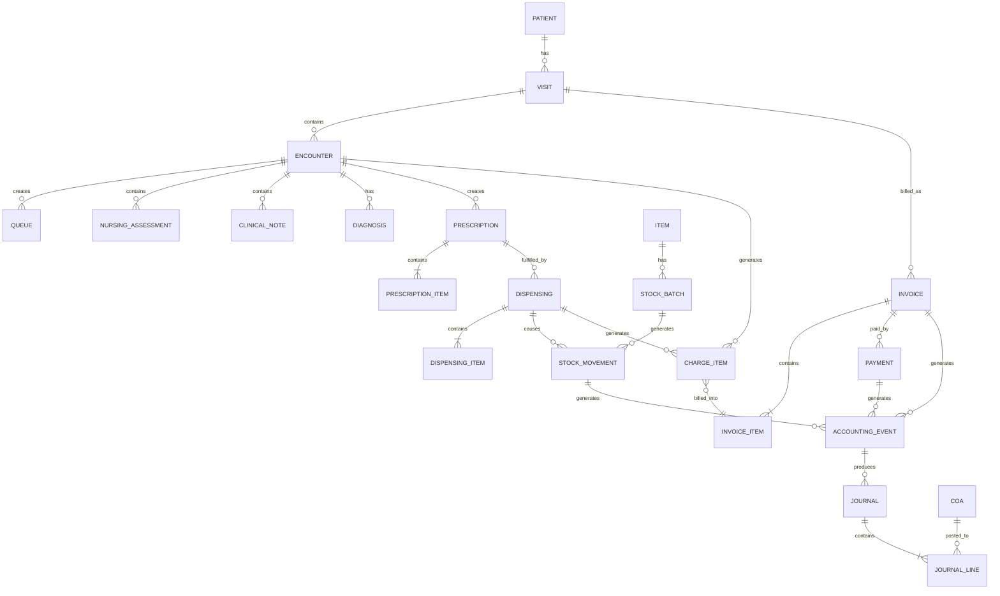

---

# 36. PostgreSQL Logical Schema

Disarankan menggunakan schema per domain.

```text
core
master
patient
registration
queue
clinical
pharmacy
inventory
billing
cashier
accounting
reporting
integration
audit
```

Contoh:

```text
patient.patients
registration.visits
clinical.encounters
clinical.nursing_assessments
clinical.diagnoses

pharmacy.prescriptions
pharmacy.prescription_items
pharmacy.dispensings

inventory.items
inventory.stock_batches
inventory.stock_movements
inventory.stock_balances

billing.charge_items
billing.invoices
billing.invoice_items

cashier.payments
cashier.payment_allocations

accounting.coa
accounting.accounting_events
accounting.journals
accounting.journal_lines

audit.activity_logs
```

---

# 37. Transaction Integrity

Transaksi yang mengubah lebih dari satu domain harus menggunakan database transaction.

Contoh dispensing:

```text
BEGIN

Save Dispensing
Save Dispensing Item
Create Stock Movement
Update/Calculate Balance
Create Charge Item
Create Accounting Event

COMMIT
```

Jika satu proses gagal:

```text
ROLLBACK
```

Tidak boleh terjadi kondisi:

```text
Dispensing = berhasil
Stock      = gagal
Billing    = berhasil
```

---

# 38. Concurrency dan Stock Locking

Inventory harus aman ketika banyak workstation melakukan dispensing secara bersamaan.

Requirement:

### NFR-CON-001

Sistem harus mencegah stock menjadi negatif akibat concurrent transaction.

### NFR-CON-002

Update saldo harus menggunakan mekanisme locking/atomic transaction.

### NFR-CON-003

Sistem harus mendeteksi concurrent update terhadap data kritis.

### NFR-CON-004

Long-running transaction harus dihindari.

---

# 39. Print Service

## 39.1 Prinsip

Spring Boot JasperReports adalah service cetak generik.

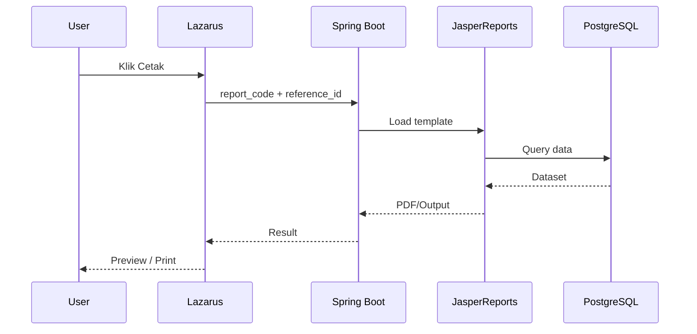

## 39.2 API Konseptual

```http
POST /api/v1/reports/render
```

Contoh request:

```json
{
  "reportCode": "OUTPATIENT_PRESCRIPTION",
  "referenceId": "RX202608130001",
  "output": "PDF"
}
```

## 39.3 Report Registry

Contoh:

```text
PATIENT_CARD
PATIENT_LABEL
QUEUE_TICKET
OUTPATIENT_PRESCRIPTION
PHARMACY_LABEL
BILLING_INVOICE
PAYMENT_RECEIPT
MEDICAL_SUMMARY
STOCK_CARD
STOCK_OPNAME
JOURNAL
GENERAL_LEDGER
TRIAL_BALANCE
BALANCE_SHEET
PROFIT_LOSS
```

## 39.4 Audit Cetak

Minimal menyimpan:

```text
print_log_id
report_code
reference_id
template_version
requested_by
requested_at
workstation
is_reprint
reprint_reason
```

---

# 40. Rekam Medis dan Audit Klinis

Data klinis harus memiliki:

- author;
- created_at;
- signed_at;
- status;
- version;
- amendment reason;
- amendment author;
- amendment time.

Status contoh:

```text
DRAFT
SIGNED
AMENDED
CANCELLED
```

SIGNED tidak berarti record lama dihapus ketika ada koreksi.

Versi lama harus tetap tersedia untuk audit.

---

# 41. Audit Trail Sistem

Audit wajib untuk minimal:

- login/logout;
- pasien merge;
- perubahan identitas pasien;
- perubahan data klinis;
- resep;
- dispensing;
- stock adjustment;
- price/tarif;
- discount;
- invoice finalization;
- void payment;
- refund;
- jurnal;
- reversal;
- perubahan permission;
- konfigurasi.

---

# 42. Security Requirements

### SEC-001

Setiap pengguna memiliki akun individual.

### SEC-002

Tidak diperbolehkan menggunakan akun bersama untuk transaksi klinis dan keuangan.

### SEC-003

Password disimpan menggunakan hashing yang aman.

### SEC-004

Sistem menerapkan RBAC.

### SEC-005

Session pengguna memiliki timeout.

### SEC-006

Aksi sensitif dapat memerlukan re-authentication atau supervisor authorization.

### SEC-007

Database credential tidak ditulis secara hard-coded dalam source code.

### SEC-008

Akses database dibatasi berdasarkan network dan credential.

### SEC-009

Komunikasi ke layanan eksternal menggunakan kanal terenkripsi.

### SEC-010

Audit log tidak dapat diubah oleh user operasional.

---

# 43. Non-Functional Requirements

## 43.1 Performance

Target awal:

| Operasi | Target |
|---|---:|
| Login | ≤ 3 detik |
| Pencarian pasien umum | ≤ 2 detik |
| Buka antrean | ≤ 2 detik |
| Simpan transaksi normal | ≤ 2 detik |
| Buka riwayat ringkas pasien | ≤ 3 detik |
| Posting pembayaran | ≤ 3 detik |
| Cetak dokumen operasional | sesuai kompleksitas report, tanpa memblokir transaksi utama |

Target harus divalidasi dengan jumlah data dan jumlah concurrent user pada rumah sakit target.

## 43.2 Availability

Sistem harus dirancang untuk operasional rumah sakit sepanjang waktu dengan mekanisme:

- backup;
- recovery;
- monitoring;
- database maintenance;
- log monitoring;
- failure handling.

## 43.3 Scalability

Sistem harus mendukung:

- penambahan workstation;
- penambahan unit;
- penambahan poli;
- penambahan gudang;
- penambahan jenis pelayanan;
- penambahan role;
- penambahan report;
- penambahan modul.

## 43.4 Maintainability

Business logic tidak boleh tersebar secara tidak terkendali pada seluruh form.

## 43.5 Observability

Sistem harus mempunyai:

- application log;
- error log;
- database monitoring;
- report service log;
- integration log;
- audit log.

---

# 44. Error Handling

Pesan error ke pengguna tidak boleh hanya menampilkan exception teknis.

Contoh:

**Tidak disarankan**

```text
SQLSTATE 23505 duplicate key...
```

**Disarankan**

```text
Nomor rekam medis sudah digunakan.
Silakan muat ulang data pasien atau hubungi administrator.
```

Exception teknis tetap dicatat pada log.

---

# 45. Idempotency

Proses kritis harus mencegah transaksi ganda akibat double-click atau retry.

Contoh:

- payment;
- dispensing;
- stock receiving;
- invoice finalization;
- journal posting.

Setiap transaksi menggunakan unique business key/idempotency key bila diperlukan.

---

# 46. Numbering Service

Nomor transaksi tidak dibuat secara random di masing-masing form.

Contoh:

```text
MRN
VISIT
ENCOUNTER
PRESCRIPTION
DISPENSING
STOCK_MOVEMENT
INVOICE
PAYMENT
JOURNAL
```

Dibuat melalui Numbering Service yang configurable.

Contoh:

```text
INV/2026/08/000001
RX/2026/08/000001
PAY/2026/08/000001
```

---

# 47. Business Date

Selain timestamp sistem, transaksi keuangan dan inventory sebaiknya memiliki `business_date`.

Hal ini diperlukan untuk:

- cut-off;
- closing;
- laporan harian;
- backdate dengan permission;
- rekonsiliasi.

---

# 48. Soft Close dan Hard Close

Accounting dapat menerapkan:

```text
OPEN
SOFT CLOSED
HARD CLOSED
```

Setelah hard close, transaksi backdate ke periode tersebut tidak boleh dilakukan tanpa prosedur pembukaan kembali yang berwenang.

---

# 49. Dashboard Operasional

## 49.1 Antrean

- jumlah menunggu;
- rata-rata waiting time;
- service time;
- dokter aktif;
- pasien selesai.

## 49.2 Farmasi

- resep menunggu;
- resep diproses;
- rata-rata waktu dispensing;
- resep selesai;
- stock out.

## 49.3 Inventory

- stok minimum;
- hampir expired;
- expired;
- slow moving;
- nilai persediaan.

## 49.4 Billing

- total charge;
- invoice;
- pembayaran;
- outstanding;
- piutang penjamin.

## 49.5 Finance

- kas;
- bank;
- AR;
- revenue;
- expense;
- inventory value.

---

# 50. Search dan Pagination

Tabel besar tidak boleh memuat seluruh data ke memory client.

Server-side/database-side filtering dan pagination digunakan untuk:

- pasien;
- transaksi;
- stok;
- invoice;
- jurnal;
- log.

Pencarian harus menggunakan index yang sesuai.

---

# 51. Database Indexing

Index minimal harus dievaluasi pada:

- patient MRN;
- NIK;
- nama pasien;
- visit number;
- encounter number;
- queue date/status;
- prescription number;
- item code;
- batch number;
- movement date;
- invoice number;
- payment number;
- journal number.

Penggunaan index harus diverifikasi berdasarkan query aktual menggunakan PostgreSQL execution plan.

---

# 52. Referential Integrity

Foreign key wajib digunakan untuk relasi kritis.

Contoh:

```text
encounter.patient_id
prescription.encounter_id
dispensing.prescription_id
stock_movement.dispensing_id
charge.encounter_id
invoice.patient_id
payment.invoice_id
journal.source_id
```

Penghapusan cascade untuk transaksi kritis harus dihindari.

---

# 53. Status-Based Workflow

Business process tidak boleh hanya ditentukan dari "data ada atau tidak".

Gunakan explicit status.

Contoh encounter:

```text
REGISTERED
NURSING
WAITING_DOCTOR
IN_PROGRESS
WAITING_SUPPORT
COMPLETED
CANCELLED
```

Invoice:

```text
DRAFT
FINAL
PARTIALLY_PAID
PAID
VOID
```

Journal:

```text
DRAFT
POSTED
REVERSED
```

---

# 54. Integrasi SATUSEHAT

Integrasi SATUSEHAT ditempatkan pada integration module/service terpisah dari form klinis.

Konsep:

```text
SIMRS Transaction
       ↓
PostgreSQL
       ↓
Integration Queue / Outbox
       ↓
Mapper
       ↓
Validator
       ↓
FHIR Payload
       ↓
SATUSEHAT
       ↓
Response Log
```

Internal database tetap menggunakan model SIMRS yang optimal untuk transaksi.

Mapping dilakukan terhadap resource yang relevan seperti:

- Patient;
- Encounter;
- Observation;
- Condition;
- Procedure;
- Medication;
- MedicationRequest;
- MedicationDispense;
- DiagnosticReport;
- resource lain sesuai use case.

---

# 55. Integrasi BPJS

Desain harus menyiapkan adapter untuk integrasi seperti:

- eligibility;
- peserta;
- rujukan;
- SEP;
- antrean;
- claim-related data;
- layanan lain sesuai ketentuan dan API yang berlaku.

Credential, endpoint, request, response, serta retry tidak ditempatkan langsung pada form pelayanan.

---

# 56. Integration Logging

Setiap request eksternal harus menyimpan:

```text
integration_log_id
system
service
reference_type
reference_id
request_at
response_at
http_status
business_status
retry_count
error_code
```

Payload sensitif hanya disimpan sesuai kebijakan keamanan yang berlaku.

---

# 57. Backup dan Recovery

Minimal mencakup:

- full backup;
- incremental/WAL strategy sesuai kebutuhan;
- off-server backup;
- retention;
- restore test;
- disaster recovery procedure.

Backup dianggap valid hanya setelah proses restore diuji secara berkala.

---

# 58. Deployment Konseptual

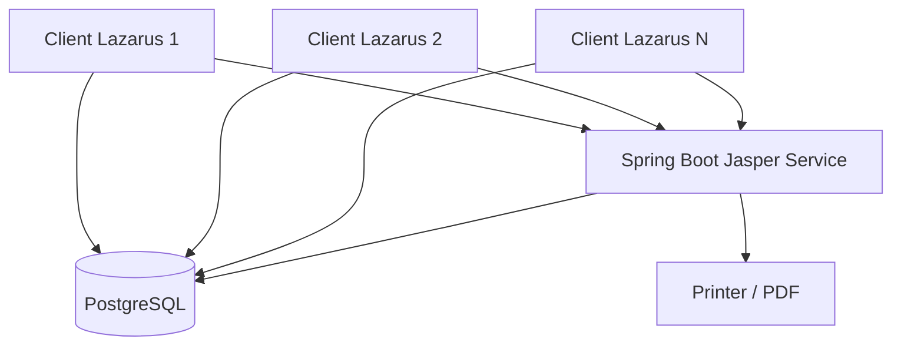

Untuk deployment yang lebih besar, koneksi database dan service dapat ditempatkan pada jaringan aplikasi yang terkontrol.

---

# 59. Struktur Project Lazarus yang Direkomendasikan

```text
simrs/
├── app/
│   ├── simrs.lpr
│   └── shell/
│
├── core/
│   ├── auth/
│   ├── rbac/
│   ├── db/
│   ├── logging/
│   ├── exception/
│   ├── configuration/
│   └── numbering/
│
├── shared/
│   ├── ui/
│   ├── components/
│   ├── helpers/
│   └── types/
│
├── modules/
│   ├── master/
│   ├── patient/
│   ├── registration/
│   ├── queue/
│   ├── nursing/
│   ├── physician/
│   ├── pharmacy/
│   ├── inventory/
│   ├── billing/
│   ├── cashier/
│   ├── accounting/
│   ├── medical_record/
│   ├── reporting/
│   └── integration/
│
├── migrations/
│
├── tests/
│
└── config/
```

---

# 60. Struktur Internal Modul

Contoh pharmacy:

```text
modules/pharmacy/
├── ui/
│   ├── frmPrescription.pas
│   ├── frmVerification.pas
│   └── frmDispensing.pas
│
├── domain/
│   ├── Prescription.pas
│   └── Dispensing.pas
│
├── services/
│   ├── PrescriptionService.pas
│   └── DispensingService.pas
│
├── repositories/
│   ├── PrescriptionRepository.pas
│   └── DispensingRepository.pas
│
└── dto/
```

---

# 61. Acceptance Criteria End-to-End Rawat Jalan

Skenario dianggap berhasil jika:

1. pasien dapat diregistrasikan;
2. visit dan encounter terbentuk;
3. nomor antrean terbentuk;
4. perawat dapat melakukan asesmen;
5. dokter dapat melihat asesmen;
6. dokter dapat menyimpan diagnosis;
7. dokter dapat membuat resep;
8. farmasi menerima resep;
9. farmasi melakukan verifikasi;
10. dispensing mengurangi stok batch yang benar;
11. stock ledger tercatat;
12. charge farmasi terbentuk;
13. charge pelayanan terkumpul pada billing;
14. invoice dapat difinalisasi;
15. kasir dapat menerima pembayaran;
16. pembayaran menghasilkan accounting event;
17. HPP obat dan persediaan terposting;
18. jurnal seimbang;
19. transaksi dapat ditelusuri kembali sampai pasien;
20. dokumen dapat dicetak melalui Spring Boot + JasperReports.

---

# 62. Acceptance Criteria Inventory

Inventory dinyatakan memenuhi baseline jika:

- tidak terjadi negative stock tanpa otorisasi kebijakan;
- batch dapat ditelusuri;
- expiry dapat dipantau;
- stock movement tidak dapat dihapus;
- reversal dapat dilakukan;
- stock opname menghasilkan adjustment terkontrol;
- on-hand stock dapat direkonsiliasi dengan ledger;
- stock valuation dapat dihitung;
- dispensing memiliki referensi ke stock movement.

---

# 63. Acceptance Criteria Accounting

Accounting dinyatakan memenuhi baseline jika:

- jurnal selalu balance;
- source transaction dapat ditelusuri;
- posted journal tidak dapat diedit;
- reversal menghasilkan jurnal baru;
- COA configurable;
- accounting mapping configurable;
- payment menghasilkan journal;
- inventory movement tertentu menghasilkan journal;
- trial balance dapat direkonsiliasi;
- closing period dapat diterapkan.

---

# 64. Acceptance Criteria Security dan Audit

- user menggunakan individual account;
- permission dapat dikonfigurasi;
- perubahan role tercatat;
- transaksi kritis mempunyai audit;
- data finalized tidak dapat dihapus langsung;
- refund/void membutuhkan reason;
- adjustment inventory membutuhkan reason;
- journal reversal membutuhkan reason;
- reprint dapat diaudit.

---

# 65. Data Migration

Jika sistem menggantikan sistem lama, migration plan minimal meliputi:

1. master pasien;
2. master dokter/pegawai;
3. unit/poli;
4. tarif;
5. item/obat;
6. opening stock dan batch;
7. saldo piutang;
8. saldo accounting;
9. data klinis historis yang dipilih.

Setiap migrasi harus melalui:

```text
Extract
  ↓
Clean
  ↓
Transform
  ↓
Validate
  ↓
Load
  ↓
Reconcile
  ↓
Sign-off
```

---

# 66. Testing Strategy

## 66.1 Unit Test

Business rule kritis.

## 66.2 Integration Test

Antarmodul dan database.

## 66.3 Transaction Test

Rollback dan concurrency.

## 66.4 UAT

Pengguna rumah sakit.

## 66.5 Performance Test

Query dan concurrent workstation.

## 66.6 Security Test

Authentication, authorization, session, dan akses data.

## 66.7 Recovery Test

Restore database dan recovery.

---

# 67. Skenario UAT Utama

## UAT-OPD-001 — Pasien Umum

```text
Registrasi
→ Keperawatan
→ Dokter
→ Resep
→ Farmasi
→ Billing
→ Kasir
→ Accounting
```

## UAT-OPD-002 — Pasien dengan Penjamin

```text
Registrasi
→ Verifikasi Penjamin
→ Pelayanan
→ Billing
→ Piutang Penjamin
→ Accounting
```

## UAT-PHA-001 — Partial Dispensing

```text
Resep
→ Stok Tidak Cukup
→ Partial
→ Stock Issue sesuai jumlah
→ Billing sesuai jumlah aktual
```

## UAT-INV-001 — Retur Obat

```text
Dispensing
→ Patient Return
→ Stock Return
→ Billing Adjustment
→ Accounting Reversal/Adjustment
```

## UAT-CASH-001 — Refund

```text
Payment
→ Authorized Refund
→ Refund Transaction
→ Accounting Event
→ Reversal Journal
```

---

# 68. KPI Produk

## Operasional

- rata-rata waktu registrasi;
- rata-rata waktu tunggu;
- rata-rata waktu konsultasi;
- rata-rata waktu farmasi;
- jumlah pasien per unit.

## Pharmacy

- dispensing turnaround time;
- resep partial;
- stock out rate;
- near-expiry value.

## Inventory

- inventory accuracy;
- stock turnover;
- expired stock;
- slow moving stock.

## Revenue

- charge capture completeness;
- outstanding receivable;
- payment collection;
- void/refund rate.

## System

- response time;
- error rate;
- database availability;
- failed print;
- failed integration.

---

# 69. Definition of Done

Suatu fitur dianggap selesai apabila:

- requirement disetujui;
- database migration tersedia;
- business rule terimplementasi;
- permission terimplementasi;
- audit terimplementasi jika diperlukan;
- error handling tersedia;
- unit/integration test selesai;
- UAT selesai;
- dokumentasi tersedia;
- report/cetakan tersedia bila diperlukan;
- deployment script tersedia;
- rollback procedure tersedia.

---

# 70. Prioritas Implementasi

## P0 — Wajib untuk Core Production

- authentication;
- RBAC;
- master;
- patient;
- registration;
- visit;
- encounter;
- queue;
- nursing;
- doctor;
- prescription;
- pharmacy;
- inventory ledger;
- billing;
- cashier;
- accounting;
- audit;
- print service.

## P1 — Sangat Penting

- procurement;
- supplier;
- stock opname advanced;
- IGD;
- rawat inap;
- bed management;
- laboratory;
- radiology;
- BPJS.

## P2 — Pengembangan Lanjutan

- operasi;
- rehabilitasi;
- gizi;
- CSSD;
- bank darah;
- SATUSEHAT advanced use case;
- mobile;
- patient portal;
- executive analytics.

---

# 71. Risiko Utama dan Mitigasi

| Risiko | Mitigasi |
|---|---|
| Logic tersebar di form Lazarus | Service/domain layer |
| Query lambat | Index, pagination, query profiling |
| Stok negatif | Transaction, reservation, locking |
| Transaksi ganda | Idempotency |
| Billing tidak sinkron | Charge item sebagai sumber |
| Accounting manual | Accounting event & mapping |
| Journal tidak traceable | source_type + source_id |
| Data klinis terhapus | version/amendment |
| User terlalu banyak akses | RBAC granular |
| Report berbeda antar client | Central Jasper service |
| Integrasi eksternal menghambat UI | Queue/outbox + worker |
| Backup tidak dapat direstore | Periodic restore test |

---

# 72. Keputusan Arsitektur Utama

1. SIMRS tetap berbasis desktop menggunakan Lazarus.
2. Satu main application menaungi seluruh modul.
3. PostgreSQL menjadi transactional source of truth.
4. Modul dipisahkan berdasarkan business domain.
5. Business logic tidak ditempatkan langsung pada UI.
6. Spring Boot + JasperReports hanya menangani pencetakan/report rendering.
7. Prescription tidak langsung mengurangi stock.
8. Dispensing menjadi trigger stock issue.
9. Inventory menggunakan stock ledger.
10. Billing menggunakan charge item.
11. Billing dipisahkan dari kasir.
12. Accounting menerima accounting event dari transaksi operasional.
13. Posted transaction dikoreksi melalui reversal.
14. Rekam medis yang finalized tidak dihapus.
15. Traceability diterapkan dari pasien sampai jurnal.
16. Integrasi eksternal dipisahkan dari form pelayanan.
17. Pengembangan dilakukan bertahap dengan rawat jalan sebagai backbone awal.

---

# 73. Target Flow Production

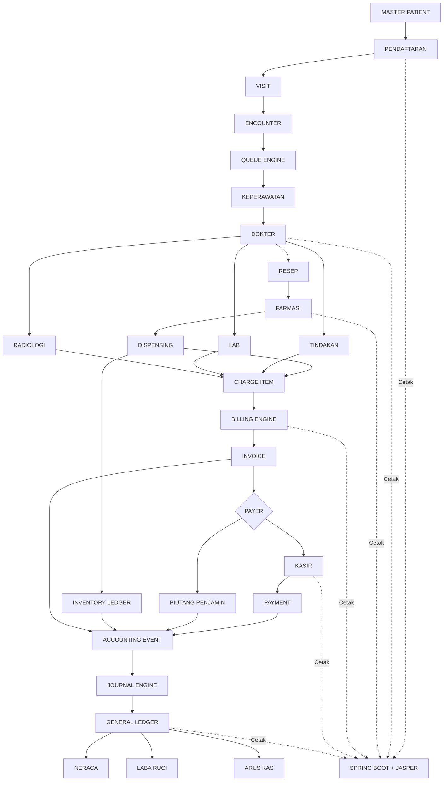

---

# 74. Kesimpulan

SIMRS Modular Desktop dirancang sebagai satu platform operasional rumah sakit yang mempunyai hubungan transaksi end-to-end, bukan sebagai kumpulan aplikasi yang berdiri sendiri.

Backbone sistem adalah:

```text
Patient
→ Visit
→ Encounter
→ Clinical Service
→ Pharmacy/Supporting Service
→ Charge
→ Billing
→ Payment/Receivable
→ Accounting
```

Inventory berjalan sebagai domain tersendiri tetapi terhubung langsung dengan pharmacy, receiving, purchasing, dan accounting.

Dengan desain ini, satu pelayanan pasien dapat ditelusuri dari sisi klinis, operasional, persediaan, pendapatan, pembayaran, hingga jurnal akuntansi.

Arsitektur ini juga mempertahankan teknologi utama yang telah dipilih:

```text
Lazarus
=
SIMRS Desktop + Business Modules

PostgreSQL
=
Transactional Database

Spring Boot + JasperReports
=
Centralized Print/Report Service Only
```

Dokumen ini menjadi baseline PRD. Tahap desain berikutnya dapat diturunkan menjadi:

1. Software Requirement Specification (SRS);
2. ERD PostgreSQL lengkap;
3. data dictionary;
4. state machine setiap modul;
5. matriks RBAC;
6. API specification untuk print dan integration;
7. detail Chart of Accounts dan accounting mapping;
8. wireframe/UI setiap modul;
9. UAT scenario;
10. deployment architecture dan database sizing.

---

## Lampiran A — Ringkasan Module Dependency

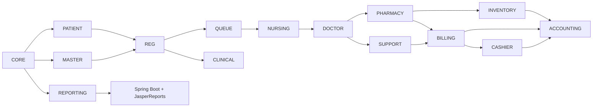

---

## Lampiran B — Prinsip Pemisahan Tanggung Jawab

| Layer/Komponen | Tanggung Jawab |
|---|---|
| Lazarus UI | Tampilan dan interaksi |
| Domain Service | Aturan bisnis |
| Repository | Akses data |
| PostgreSQL | Persistensi dan integritas data |
| Worker/Outbox | Proses asynchronous/integration |
| Spring Boot | Endpoint service cetak |
| JasperReports | Render dokumen |
| External Adapter | BPJS/SATUSEHAT/sistem lain |

---

## Lampiran C — Out of Scope Spring Boot Jasper

Komponen cetak **tidak boleh** menangani:

```text
Patient Registration
Queue Processing
Clinical Validation
Prescription Business Rule
Stock Deduction
Price Calculation
Billing Calculation
Payment Posting
Accounting Posting
BPJS Transaction Logic
SATUSEHAT Transaction Logic
```

Komponen hanya menangani:

```text
Receive Print Request
Resolve Report Template
Read Required Data
Render Report
Return PDF / Print Output
Log Printing Activity
```

---

**End of Document**
